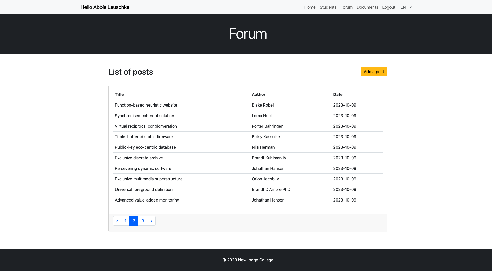

# Plateforme de partage étudiants - Laravel CRUD

<!-- TABLE OF CONTENTS -->

  
🏁 Sommaire

  <ol>
    <li><a href="#-intro">Intro</a></li>
    <li><a href="#-features">Features</a></li>
    <li><a href="#-command-lines">Command lines</a></li>
    <li><a href="#-built-with">Built with</a></li>
    <li><a href="#-screenshot">Screenshot</a></li>
  </ol>

## ⚡ Intro

Création d'une application web avec Laravel et SQL qui propose aux étudiants d'un collège un espace virtuel pour partager de l'information et des documents.

##### Connexion et création de compte
Un étudiant inscrit sur la plateforme doit se connecter à son compte pour accéder au contenu.
Seul un étudiant déjà inscrit et connecté peut ajouter un nouvel étudiant. Le nouvel étudiant créé recevra un courriel d'activation de compte à partir duquel il pourra choisir son mot de passe.

##### Accès et autorisations
Seul les étudiants connectés peuvent accéder à la liste de tous les étudiants et de leurs informations, ainsi qu'à tous les articles et à tous les fichiers partagés.
Un étudiant peut modifier ou supprimer uniquement ses propres informations, ainsi que les articles qu'il a rédigés et les fichiers qu'il a partagés.

##### Choix de langue et affichage du contenu
La plateforme est multilingue, tout le contenu du site peut être affiché en anglais (par défaut) et en français.
Les étudiants sont invités à créer du contenu dans les deux langues, l'anglais est obligatoire et le français est optionnel.
Le titre et le contenu d'un article, ainsi que le titre d'un document sont affichés dans la langue qui est sélectionnée dans le menu. Si la version française n'existe pas, la version anglaise par défaut est affichée.

👩‍💻 **Testez l'application avec un utilisateur par défaut**
- courriel : tbins@example.com
- mdp : Maisonneuve!1234

**Lien vers l'application :** [NewLodge College Network](https://network.johannapenet.com/)

## 🎯 Features

#### Login
- Se connecter à son compte
- Réinitialiser son mot de passe
- Création d'un nouveau mot de passe à partir du lien d'activation
- Se déconnecter

#### Choix de langue
- Choisir l'affichage en anglais ou en français

#### Liste des étudiants
- Afficher tous les étudiants
- Naviguer dans la liste grâce à une pagination
- Créer un nouvel étudiant
- Afficher le détail d'un étudiant
- Modifier et supprimer les informations de l'étudiant connecté

#### Liste des articles
- Afficher tous les articles
- Naviguer dans la liste grâce à une pagination
- Créer un nouvel article
- Afficher le détail d'un article
- Modifier et supprimer un article (quand l'auteur est l'utilisateur connecté)

#### Liste des fichiers
- Afficher tous les fichiers
- Naviguer dans la liste grâce à une pagination
- Déposer un nouveau fichier
- Télécharger un fichier
- Modifier et supprimer un fichier (quand l'auteur est l'utilisateur connecté)

## 🚀 Command lines

*Création du projet*
  - `composer create-project --prefer-dist laravel/laravel Maisonneuve2296540`

*Création des modèles*
  - `php artisan make:model Etudiant -m`
  - `php artisan make:model Ville -m`
  - `php artisan make:model ForumPost -m`
  - `php artisan make:model DocFile -m`

*Création des tables*
  - `php artisan migrate`

*Génération de données de tests (15 villes, 100 étudiants, 20 articles)*
  - `php artisan make:factory VilleFactory`
  - `php artisan make:factory EtudiantFactory`
  - `php artisan make:factory ForumPostFactory`
  - `php artisan tinker`
  - `\App\Models\Ville::factory()->times(15)->create()`
  - `\App\Models\Etudiant::factory()->times(100)->create()`
  - `\App\Models\ForumPost::factory()->times(20)->create()`

*Création des controllers*
  - `php artisan make:controller EtudiantController -m Etudiant`
  - `php artisan make:controller CustomAuthController -m User`
  - `php artisan make:controller ForumPostController -m ForumPost`
  - `php artisan make:controller DocFileController -m DocFile`
  - `php artisan make:controller LocalizationController`

*Création du dossier lang et du middleware multilangue*
  - `php artisan lang:publish`
  - `php artisan make:middleware Localization`

## 🤖 Built With
   

## 🌐 Screenshot
